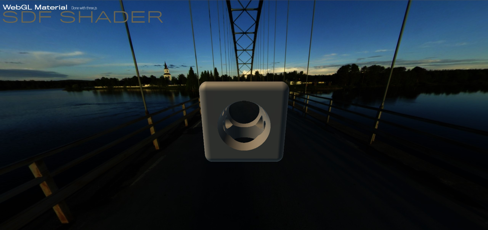

# Sdf-shader

Three.js experiment with Signed Distance Field

## Description

This project show how to setup a custom material to render Signed Distance Field using [three.js](https://threejs.org/).

You can control the camera using mouse. 

## Youtube video

Check the [video](https://youtu.be/s6cE8ixvcqk) on youtube.
